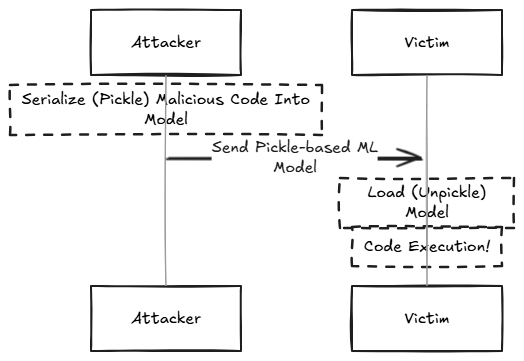

## Overview

A Pickle-based model contains serialized [Pickle](https://docs.python.org/3/library/pickle.html) data which may cause **execution of malicious Python code** when the model is loaded, using the `getattr` function.

Many ML model formats such as PyTorch, JobLib, NumPy and more, use Python's Pickle serialization format as part of their internal storage.

The Pickle format is well-known to be a **dangerous** serialization format, since in addition to serialized data, it may contain serialized code which will be automatically executed when the Pickled/Serialized file is loaded.



Specifically - the potentially malicious Python code may contain a reference to the `getattr` function, which is considered a malicious function by many ML model scanners.

While `getattr` is a basic method used in many legitimate codebases, it can be abused in order to run malicious code.


## Time of Infection

**[v] Model Load**

[] Model Query

[] Other


## Legitimate Use of getattr

Many legitimate ML libraries such as [fastai](https://github.com/fastai/fastai) use `getattr` for valid reasons when training an ML model.

In many deep learning frameworks, especially in object detection models, the `getattr` function is commonly used in model definitions. It dynamically retrieves methods or attributes based on their names, allowing for greater flexibility in execution.


## Malicious Use of getattr

However, getattr can be abused for malicious purposes. For example -

```python
class Exploit:
    def __init__(self):
        self.malicious_method = lambda: __import__('os').system('rm -rf /')

def dangerous_getattr(obj, method_name):
    # An attacker could potentially execute arbitrary system commands
    return getattr(obj, method_name)()

exploit = Exploit()
# This could potentially execute a destructive system command
dangerous_getattr(exploit, 'malicious_method')
```

In this example, `getattr()` allows for dynamically calling a method that:

- Imports the `os` module
- Executes a destructive system command
- Could potentially delete critical system files
- Demonstrates how runtime attribute lookup can be exploited for unauthorized actions


## Evidence Extraction and False Positive Elimination

To safely determine if the `getattr` use is benign:

1. Examine the specific parameters passed to `getattr`
2. Verify the source and context of attribute access
3. Confirm the object and attribute namespaces are controlled and trusted
4. Validate that the retrieved attributes are limited to expected, safe operations

JFrog conducts a detailed parameter analysis to determine whether `getattr` is used maliciously, by:

- Confirming the exact attributes being accessed
- Verifying no unexpected or dangerous method calls are used
- Ruling out potential arbitrary code execution scenarios
- Classifying the `getattr` usage as safe if it meets the above safety criteria

**This systematic approach transforms an initial indication of "potential security concern" to a validated safe model through deep contextual examination.**


## Additional Information

* https://jfrog.com/blog/jfrog-and-hugging-face-join-forces/

* https://blog.trailofbits.com/2024/06/11/exploiting-ml-models-with-pickle-file-attacks-part-1/
