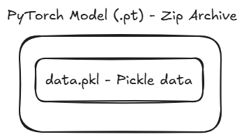

## Overview

A PyTorch model contains serialized [Pickle](https://docs.python.org/3/library/pickle.html) data which may cause **execution of malicious Python code** when the model is loaded. 

The PyTorch model format internally uses Python's Pickle data serialization format. 



The Pickle format is well-known to be a **dangerous** serialization format, since in addition to serialized data, it may contain serialized code which will be automatically executed when the Pickled/Serialized file is loaded.


## Time of Infection

**[v] Model Load**

[] Model Query

[] Other


## Legitimacy of embedded Pickle code

ML model authors may often bundle their model with "setup code" - code that is meant to run on the machine that uses the model, before the actual model data is used. This code can, for example, set up needed environment variables, perform optimization based on the local machine parameters or download extra needed dependencies.

However - with relation to Pickle-based formats, **it is extremely rare that ML model authors would choose to inject the legitimate model setup code into the model's Pickle data.**

Rather - this code is bundled outside of the Pickle data, and is usually executed either -

1. Manually, by the model user that read the model's usage guide
2. Automatically, by some other code execution capability provided by the loading library

Therefore - auto-executing code that is found in the Model's Pickle data has a very high chance of being malicious.


## Evidence Extraction and False Positive Elimination

To safely determine if the suspected model contains malicious Pickled code -

1. Extract the suspected PyTorch model as a ZIP archive, to retrieve the "data.pkl" Pickle file

2. Decompile data.pkl, ex. using [Fickling](https://github.com/trailofbits/fickling) -

   ```python
   import ast
   from fickling.fickle import Pickled
   
   pickledata = open("data.pkl", "rb").read()
   fickled_object = Pickled.load(pickledata)
   print(ast.dump(fickled_object.ast, indent=4))
   ```

3. Examine the decompiled Python code to determine if it contains any malicious instructions

   

JFrog conducts extraction, decompilation and detailed analysis on each PyTorch model in order to determine whether any malicious code is present.


## Additional Information

* https://discuss.pytorch.org/t/securely-serializing-loading-untrusted-pytorch-models/119744